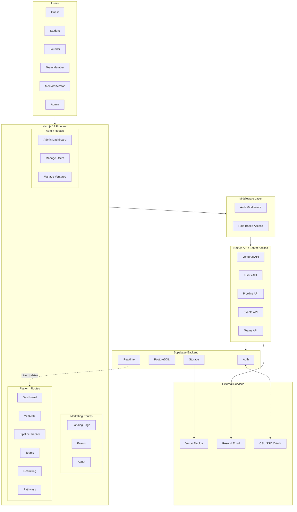

# RAM Ventures - System Architecture

## Tech Stack

| Layer | Technology |
|-------|------------|
| Frontend | Next.js 14 (App Router), React 18, TypeScript, Tailwind CSS, GSAP |
| Backend | Next.js API Routes / Server Actions |
| Database | Supabase (PostgreSQL) + Real-time |
| Auth | Supabase Auth (+ CSU SSO via OAuth) |
| Storage | Supabase Storage |
| Deploy | Vercel |
| Email | Resend |

## App Router Structure

```
app/
├── (marketing)/          # Public pages
│   ├── page.tsx          # Landing
│   ├── about/
│   ├── events/
│   └── layout.tsx
│
├── (platform)/           # Authenticated app
│   ├── layout.tsx        # Dashboard layout
│   ├── dashboard/
│   ├── ventures/
│   ├── pipeline/
│   ├── teams/
│   ├── recruiting/
│   ├── pathways/
│   └── profile/
│
├── (admin)/              # Admin-only
│   ├── layout.tsx
│   └── admin/
│
├── (auth)/               # Auth pages
│   ├── login/
│   └── signup/
│
├── api/                  # API routes
│   ├── ventures/
│   ├── events/
│   ├── users/
│   ├── pipeline/
│   └── teams/
│
└── middleware.ts         # Auth + route protection
```

## User Roles

| Role | Access |
|------|--------|
| Guest | Marketing pages, events (read-only) |
| Student | Browse ventures, apply, join pathways |
| Founder | Create/manage ventures, pipeline |
| Team Member | Ops/Analytics/Investment/Tech dashboards |
| Mentor/Investor | Alumni hub, mentorship matching |
| Admin | Full access |

## System Architecture Diagram



## Links

- [Edit System Architecture](https://mermaid.ai/live/edit?utm_source=mermaid_mcp_server&utm_medium=remote_server&utm_campaign=claude#pako:eNqNVFFv2yAQ_ivI72k1aU_TVClp2qlSs2Zxupdlmoh9jb3YEGGcNFr333cc4BiTVPMLH3wf-O67gz9JJnNIPiUvlTxkBVeaLScrwfBr2vVG8V3BnhtQzY9VQuMq-Wlp831podHI0BgwqW5zEIZzKGDvZStyUMg6FLBL4PUM6jUJzITZWSCa4ZnSCCy4fhB7jEGGonFelwI1NHYMiHwlBjneKyk0Eij-Cq_66nfDPnzsVoNDuz0zrragS7ExUXjMFrLVENpkvkcucit1iM35BiLZ3R7TMWZbEPHjNR5vMjJjwFJWUYzziusXqWrc4uGlCKe8KdaSK-NBhyPVdwyrVWBC9DDSzMsdVKUA81MH2VLxbDuooS924-ocn7SATLWl8_g0if_IdXHgR3OQh_9hDrXFnAuofI9c8oZIY0onvOzQjAusrL80dsbiu3OS9ix16rPOdjmc699ZmecVHLgypp8m2HbHgenjVheB2iz09gfihazgtoBsa-xHPJrwBnI2zjJomncv1MSUO7hP4_kDu2YpqD0oPEGXUoQJ-qxR2Osusy-QkZVWQzAS-J6zmq4DhzJ7w6zI4khCTWkVBAPBuazTdsfXaJF59xz0TkRFcNYH61Ou_f65bPRGQfrtMawI8EqXNdB9sHDw8EqFLUQPL6F347171aAEN_3vIVWozGBYG5XRNbGATWFXyeMgssYW3AJ2V_OyChS36fOvNH1CCSKGiD0FDvQitJUdjW5ObzCt-xlRvaYlstf3hvbGE-cmRPjSWIb6_7NZd_HZZWcfbbBJxwfZTO26rwYbXY1u3vCZL_d47Xc5p_fkrXuJk7__AA8bS9Y)
- [Edit Database Schema](https://mermaid.ai/live/edit?utm_source=mermaid_mcp_server&utm_medium=remote_server&utm_campaign=claude#pako:eNq1Vslu4zAM_RUj9_5Az4O5zGUucytgKBKTMNU2WpIaVf99KCuO1zROiwkCIxFJm-_xkfT7hhsBm-cNuB_I9o6pF13RJ3pwvkrp6cm8VyfQITqoFahtPn6uXjZHg9q_bBa8AzC10hXynWsHe_TBsYBGl4hyQo6LUcxaiXzg7uNWYVh2VvQE4_wBbfG1zAXkaFmAScCHeXpKqSLL4cya4r0zUprz1bFcL3R8Ss-BXYOm7saCrp2RUDzNbjcAOnW2aEGihto6s6fzEkNk8debMTN-HHDAE0xg5DrdLtoAQLm2tbpbuVnYAO2a9IYFeS9_2oOIoqLv71_9GT0Y9b4CxVBWf-aGXZSy1kzBzMJOLDBXRyd7E-ioqpxn1lOIguClnYlagEtFQwk1JZl_MKFQdzCv6V2EU9PPn_NsFDsaNzulhhOxpaJugA3sAd5CtUXTnxy90dvKv6KUfuCHinJiylbcAWla1CwU60dH5lUe6_gcM9bmIcBzhzanOSGMHr2HtoRMNMlDSHszJOZyT2n2Zkx3QdOS4msNIEDMorjRgfFQtxWe5N6h3TYjsreGKsh0hb6mSBLVV5i69sEdwtqzLmZS9daWZTw1DHXW6YubXmn5yUMG-7TzGF3Kej4ivpH3qqp2LKuTrblRVkKAuZVHahZFDJyYRJEZn_tYDPxQt8-ZG3eZEzHRojZ5cI-xODghnOdq6LmLViyXvAzB9Z2RB7aFy8RLTDPZ0Drxl9mQB0UKwA-jCi620CiDhxTXBnxFbkSq-JrCupX4EE_wZqVxJGoixYF1oCGS1vGEPLUtSO1JvNH6uNjuk9ZPjra7MeBQC8ViYiBNdudXDJf19R9mYGhshns27tUfjE0ClKkFa9KBljQxZ3TSELKZbr1MPF1dqLNEl6ygxcR2HatljfYGorPizDKOobk7FcfcTJb5GiWWuIekSIhC9INXPBCJhQC50xNnmoOU1POLLPUhc4kOXjO-Mf0uvAYMEtZrsexk4u9vRLc05Yj3Hba4HtlGo_ekNaCWSL-7ozJnU0MLmPLztAZu1Y_4FsRVYpyDpfyTgyPwcKt2LZgllMP38zUgi_8ilGwCeISBMaTSG6nbaOKTXh0i2Xz8A035RXg)
